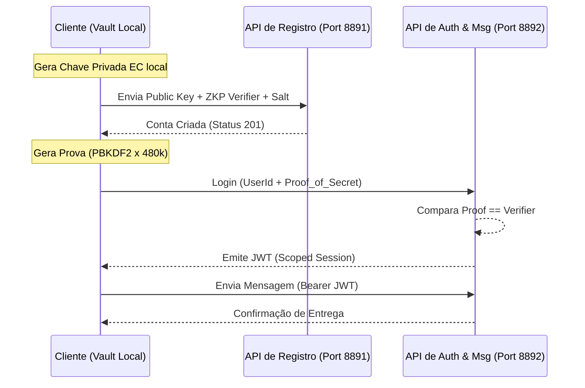

# 🔐 Simple Message Xchanger (SMX) — ZKP Blind Auth PoC


<p align="center">
  
  
  
</p>

<p align="center">
  
  
  
  
</p>

---

## 🏛️ Visão Arquitetural: O Paradigma "Trustless"

O **Simple Message Xchanger (SMX)** não é apenas um serviço de mensagens; é uma demonstração de **Soberania de Dados** e **Custódia Cega**. Em sistemas convencionais, o servidor é um "Honeypot" de segredos. No SMX, aplicamos o princípio de **Blind Proof of Authority**, onde o servidor atua como um validador matemático, nunca como um guardião de senhas.

### 🎯 O Problema da Centralização de Segredos
Sistemas tradicionais armazenam hashes de senhas (bcrypt/argon2). Embora seguros, eles exigem que o cliente envie o segredo original para o servidor processar. Se o TLS for quebrado ou o servidor for interceptado em memória, o segredo é exposto.

### 🛡️ A Solução ZKP (Zero-Knowledge Proof)
No SMX, utilizamos uma derivação determinística baseada em **PBKDF2-HMAC-SHA256**.
1.  **O Cliente** gera o verificador localmente.
2.  **O Servidor** armazena apenas um `zkp_verifier` (um resíduo matemático).
3.  **A Prova** é gerada no lado do cliente a cada login e enviada para comparação de igualdade.
4.  **O Resultado:** O servidor autentica o usuário com 100% de certeza, sem nunca ter visto, tocado ou processado a senha real.

---

## 🛠️ Stack Tecnológica & Engenharia

### Camadas Clean Architecture (DDD Pattern)
O projeto foi estruturado para ser agnóstico a frameworks, permitindo a substituição da camada de transporte ou persistência sem afetar o core criptográfico.

| Camada | Responsabilidade | Design Pattern |
| :--- | :--- | :--- |
| **Domain** | Entidades de conta, lógica de verificação e regras de mensagens. | `Entity`, `Value Object` |
| **Application** | Orquestração de casos de uso: Login, Registro, Troca de Mensagens. | `Use Case`, `Input/Output Ports` |
| **Infrastructure** | Adaptadores para FastAPI, Persistência JSON/DB, Gerador JWT e Criptografia. | `Adapter`, `Repository` |
| **Presentation** | Endpoints REST, Middleware de Telemetria e Clientes de Console (CLI). | `Controller`, `CLI Client` |

---

## ⚙️ Fluxo Operacional de Alta Segurança



---

## 🔐 Deep Dive: Especificações Criptográficas

*   **Identidade Digital:** Baseada em Curva Elíptica (EC) para garantir assinaturas leves e seguras.
*   **Derivação de Chave (KDF):** `PBKDF2` com `HMAC-SHA256`.
*   **Fator de Custo:** **480.000 iterações**, projetado para inviabilizar ataques de força bruta em hardware convencional (GPU/ASIC).
*   **Blind Authority:** O servidor de autenticação (`main_auth.py`) não possui conexão com a base de chaves privadas; ele apenas valida provas contra veríficadores pré-existentes.
*   **Transporte:** Hardened TLS (HTTPS) obrigatório em ambos os microserviços.

---

## 🚀 Guia de Execução (PoC)

### 1. Preparação do Ambiente
```bash
# Clone o repositório
git clone https://github.com/EliasAndrade/Simple-Message-Xchanger.git
cd Simple-Message-Xchanger

# Setup de dependências
pip install -r requirements.txt
```

### 2. Inicialização dos Microserviços
Execute cada comando em um terminal separado:
```bash
# 1. Gerar Certificados TLS
python scripts/tls_cert_generator.py

# 2. Subir API de Registro
python src/main_register.py

# 3. Subir API de Autenticação/Mensagens
python src/main_auth.py
```

### 3. Operação do Cliente
```bash
# Registrar nova identidade cega
python src/client_register.py

# Autenticar via ZKP e enviar mensagens
python src/client_login.py
```

---

## 📈 Roadmap & Evolução
- [ ] **Implementação de ZK-SNARKs:** Para provas de atributos sem revelar a identidade.
- [ ] **End-to-End Encryption (E2EE):** Criptografia de mensagens no nível da aplicação além do transporte TLS.
- [ ] **Persistence Layer:** Migração de JSON para PostgreSQL com suporte a schemas multi-tenant.

---

## 👨‍💼 Sobre o Autor

**Elias Andrade**  
*Enterprise Architect & Cybersecurity Researcher*  
**O2 Data Solutions**

Este projeto é parte de um portfólio de **Engenharia de Resiliência**. Ele demonstra como conceitos acadêmicos de Prova de Conhecimento Zero podem ser traduzidos em implementações práticas de alta performance para o mercado B2B e sistemas de missão crítica.

---
<p align="center">
  <sub>"In math we trust, everyone else must bring a proof."</sub>
</p>
